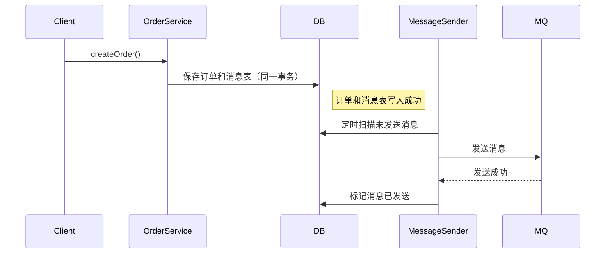

# 本地消息表分布式事务 Demo  
# Local Message Table Distributed Transaction Demo

## 方案简介 | Overview

本地消息表方案通过将业务数据和消息写入同一数据库事务，保证消息可靠投递，实现最终一致性。
The local message table solution ensures reliable message delivery and eventual consistency by writing business data and messages in the same database transaction.

## 运行方式 | How to Run

```bash
mvn spring-boot:run
```
- 默认端口 | Default port: `8083`

## 典型接口 | Typical API

- 创建订单 | Create Order  
  `POST http://localhost:8083/order/create?name=testOrder`

## 主要代码结构 | Main Code Structure

- `Order`：订单实体 | Order entity
- `Message`：消息表实体 | Message table entity
- `OrderService`：订单服务 | Order service
- `MessageSender`：定时补偿 | Scheduled message sender
- `OrderController`：REST接口 | REST controller

## 依赖环境 | Prerequisites

- JDK 8+
- Maven 3.6+
- H2数据库（内存）| H2 (in-memory)

## 参考 | Reference

- [本地消息表模式](https://martinfowler.com/articles/patterns-of-distributed-systems/local-transactional-outbox.html)

---

## 架构流程图 | Architecture Diagram

