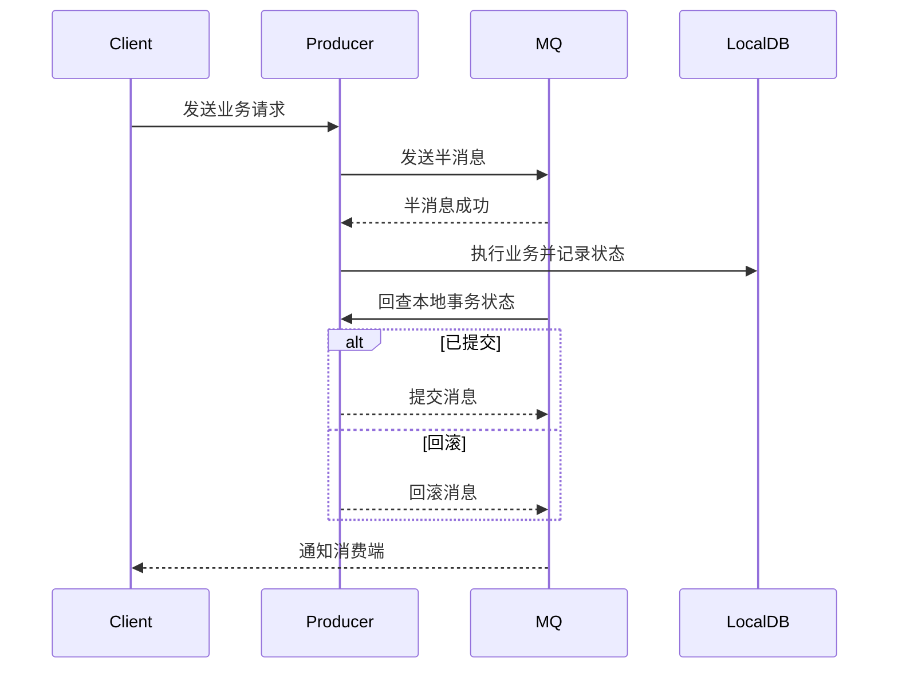

# 可靠消息+状态检查分布式事务 Demo  
# Reliable Message + Status Check Distributed Transaction Demo

## 方案简介 | Overview

通过RocketMQ事务消息和本地状态回查，实现分布式事务的最终一致性。
Achieve eventual consistency in distributed transactions via RocketMQ transactional messages and local status checking.

## 运行方式 | How to Run

1. 启动RocketMQ服务 | Start RocketMQ server
2. 启动本模块 | Start this module
   ```bash
   mvn spring-boot:run
   ```
- 默认端口 | Default port: `8085`

## 典型接口 | Typical API

- 发送事务消息 | Send transactional message  
  `POST http://localhost:8085/mq/send?name=testOrder`

## 主要代码结构 | Main Code Structure

- `Order`：订单实体 | Order entity
- `OrderRepository`：订单持久化 | Order repository
- `MQController`：REST接口 | REST controller

## 依赖环境 | Prerequisites

- JDK 8+
- Maven 3.6+
- RocketMQ

## 参考 | Reference

- [RocketMQ事务消息](https://rocketmq.apache.org/docs/transactionmessaging/)

---

## 架构流程图 | Architecture Diagram

