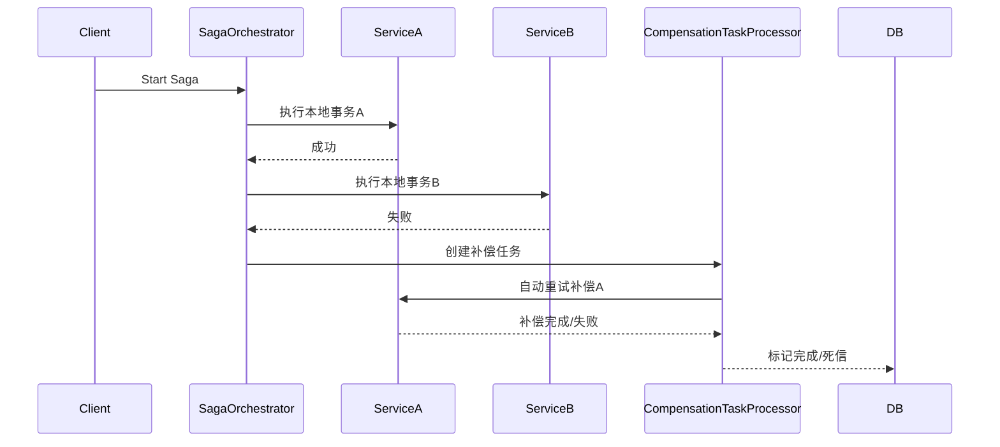

# SAGA（长事务补偿）分布式事务 Demo  
# SAGA (Long Transaction Compensation) Distributed Transaction Demo

---

## 方案简介 | Overview

SAGA 通过将长事务拆分为一系列可补偿的本地事务，适用于复杂业务流程（如酒店+航班预订）。本Demo集成了补偿重试与死信机制，自动处理补偿失败和人工介入场景。
SAGA splits a long transaction into a series of compensatable local transactions, suitable for complex business processes (e.g., hotel + flight booking). This demo integrates compensation retry and dead-letter mechanisms for robust failure handling.

---

## 业务流程 | Business Flow

1. 预订酒店（bookHotel）
2. 预订航班（bookFlight）
3. 任一步失败，自动创建补偿任务（如cancelHotel）
4. 定时任务自动重试补偿，超过5次失败标记为死信，便于人工介入

---

## 关键特性 | Key Features

- 自动补偿任务调度与重试
- 补偿死信机制，防止无限重试
- 业务幂等性与分布式唯一ID支持
- 详细日志与可观测性

---

## 运行方式 | How to Run

```bash
mvn spring-boot:run
```
- 默认端口 | Default port: `8084`

---

## 典型接口 | Typical API

- 触发SAGA流程 | Trigger SAGA process  
  `POST http://localhost:8084/saga/book?bizId=order123`

---

## 补偿重试与死信机制 | Compensation Retry & Dead Letter

- 失败时自动创建补偿任务（CompensationTask）
- 定时任务自动重试补偿，失败超过5次自动标记为死信
- 可通过数据库或日志监控死信任务，便于人工处理

---

## 架构流程图 | Architecture Diagram



---

## 主要代码结构 | Main Code Structure

- `Order`：订单实体 | Order entity
- `SagaService`：Saga服务，含补偿任务创建 | Saga service with compensation task creation
- `CompensationTask`：补偿任务实体 | Compensation task entity
- `CompensationTaskProcessor`：定时补偿调度 | Scheduled compensation processor
- `CompensationTaskRepository`：补偿任务持久化 | Compensation task repository

---

## 依赖环境 | Prerequisites

- JDK 8+
- Maven 3.6+
- H2数据库（内存）| H2 (in-memory)

---

## 参考 | Reference

- [SAGA模式](https://microservices.io/patterns/data/saga.html)
- [分布式事务最佳实践](https://martinfowler.com/articles/patterns-of-distributed-systems/distributed-transactions.html) 