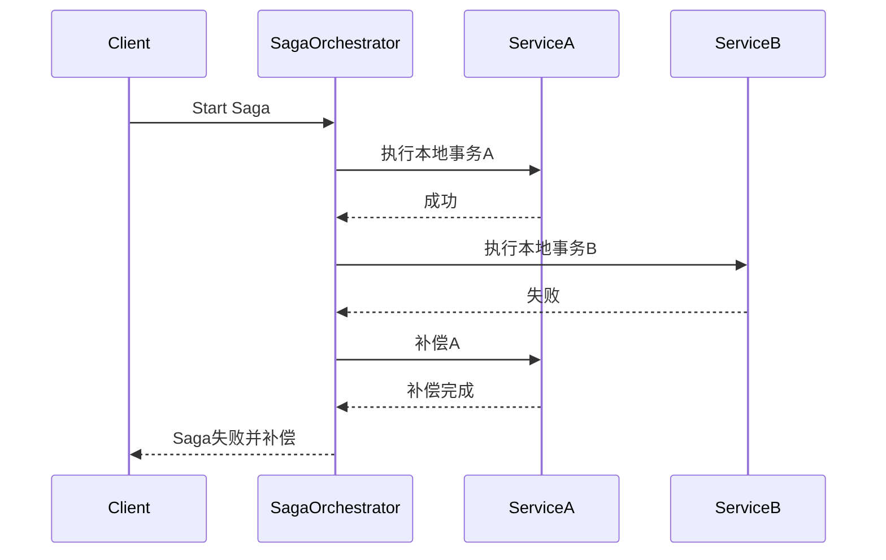

# SAGA（长事务补偿）分布式事务 Demo  
# SAGA (Long Transaction Compensation) Distributed Transaction Demo

## 方案简介 | Overview

SAGA 通过将长事务拆分为一系列可补偿的本地事务，适用于复杂业务流程（如酒店+航班预订）。
SAGA splits a long transaction into a series of compensatable local transactions, suitable for complex business processes (e.g., hotel + flight booking).

## 运行方式 | How to Run

```bash
mvn spring-boot:run
```
- 默认端口 | Default port: `8084`

## 典型接口 | Typical API

- 触发SAGA流程 | Trigger SAGA process  
  `POST http://localhost:8084/saga/book`

## 主要代码结构 | Main Code Structure

- `Order`：订单实体 | Order entity
- `SagaService`：Saga服务 | Saga service
- `SagaController`：REST接口 | REST controller

## 依赖环境 | Prerequisites

- JDK 8+
- Maven 3.6+
- H2数据库（内存）| H2 (in-memory)

## 参考 | Reference

- [SAGA模式](https://microservices.io/patterns/data/saga.html)

---

## 架构流程图 | Architecture Diagram

