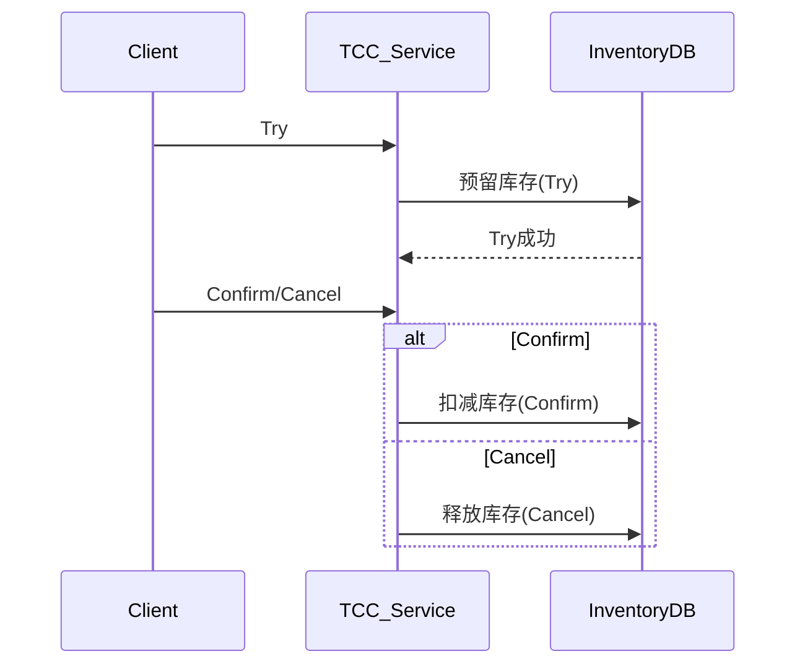

# TCC（Try-Confirm-Cancel）分布式事务 Demo  
# TCC (Try-Confirm-Cancel) Distributed Transaction Demo

## 方案简介 | Overview

TCC 是一种高性能、业务级分布式事务方案，适用于电商下单、库存扣减等场景。
TCC is a high-performance, business-level distributed transaction solution, suitable for e-commerce order placement, inventory deduction, etc.

## 运行方式 | How to Run

```bash
mvn spring-boot:run
```
- 默认端口 | Default port: `8082`

## 典型接口 | Typical API

- Try 预留库存 | Try reserve inventory  
  `POST http://localhost:8082/inventory/try?id=1&count=2`
- Confirm 确认 | Confirm  
  `POST http://localhost:8082/inventory/confirm?id=1&count=2`
- Cancel 取消 | Cancel  
  `POST http://localhost:8082/inventory/cancel?id=1&count=2`

## 主要代码结构 | Main Code Structure

- `Inventory`：库存实体 | Inventory entity
- `InventoryRepository`：库存持久化 | Inventory repository
- `InventoryTccServiceImpl`：TCC服务实现 | TCC service implementation
- `InventoryController`：REST接口 | REST controller

## 依赖环境 | Prerequisites

- JDK 8+
- Maven 3.6+
- H2数据库（内存）| H2 (in-memory)

## 参考 | Reference

- [TCC-Transaction模式](https://github.com/changmingxie/tcc-transaction)

---

## 架构流程图 | Architecture Diagram

