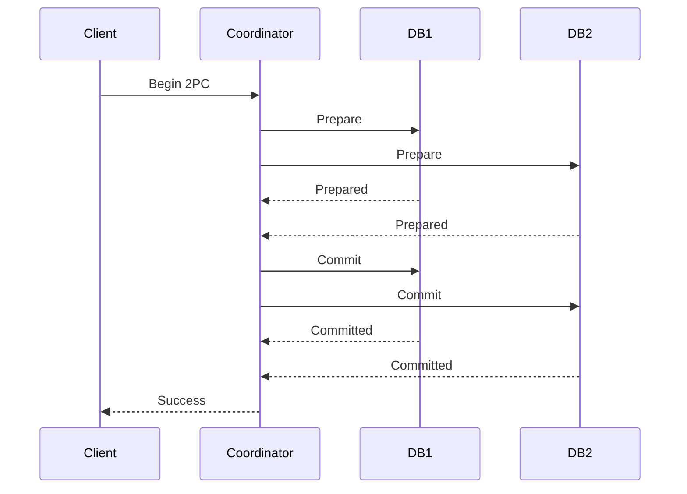

# 2PC（两阶段提交）分布式事务 Demo  
# 2PC (Two-Phase Commit) Distributed Transaction Demo

## 方案简介 | Overview

2PC（Two-Phase Commit）是一种强一致性分布式事务协议，适用于银行、支付等对一致性要求极高的场景。
2PC (Two-Phase Commit) is a strong consistency distributed transaction protocol, suitable for scenarios such as banking and payment where strict consistency is required.

## 运行方式 | How to Run

```bash
mvn spring-boot:run
```
- 默认端口 | Default port: `8081`

## 典型接口 | Typical API

- 创建订单 | Create Order  
  `POST http://localhost:8081/order/create?name=testOrder`

## 主要代码结构 | Main Code Structure

- `Order`：订单实体 | Order entity
- `OrderRepository`：订单持久化 | Order repository
- `OrderService`：订单服务（含事务）| Order service (with transaction)
- `OrderController`：REST接口 | REST controller

## 依赖环境 | Prerequisites

- JDK 8+
- Maven 3.6+
- H2数据库（内存）| H2 (in-memory)

## 参考 | Reference

- [分布式事务模式](https://martinfowler.com/articles/patterns-of-distributed-systems/distributed-transactions.html)

---

## 架构流程图 | Architecture Diagram

